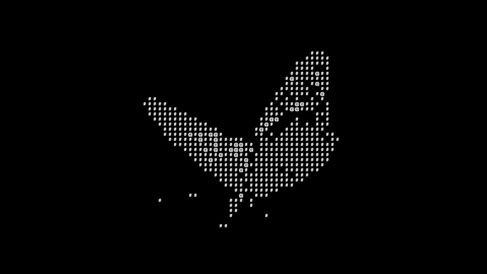

# ASCII Butterfly Viewer

A dynamic 3D butterfly visualization with a **real-time ASCII shader** overlay, powered by **React Three Fiber**, **Three.js**, and **postprocessing**. This interactive WebGL experience includes **GLTF model animation**, fully responsive **ASCII effects**, **Leva UI controls**, and smooth **orbit camera navigation**.

[](https://ascii-butterfly.vercel.app/)

---

## ✨ Features

* 🦋 **Animated Butterfly** with bone-based GLTF animation
* 🔤 **ASCII Shader Overlay** powered by `@react-three/postprocessing`
* 🎨 **Customizable UI** with Leva for ASCII cell size, color, and toggling
* 🎥 **Orbit Camera Controls** with locked zoom and smooth damping
* 💡 **Lighting System** with ambient + directional light for depth and realism
* 🚀 **Optimized Load Experience** with progress-based `Loader` screen
* ⚡ **Responsive Canvas** with auto-adjusting resolution on resize

---

## 🧠 How It Works

* Butterfly model (`butterflyDraco.gltf`) is loaded using `useGLTF` and cloned via `SkeletonUtils` for safe reuse
* Skinned mesh animations are handled with `useAnimations` and triggered on mount
* ASCII effect is applied via `postprocessing`'s `ASCIIEffect`, wrapped in `EffectComposer` and `EffectPass`
* UI parameters (`asciiEnabled`, `cellSize`, `color`) are wired to shader logic using Leva
* Resize events dynamically update the renderer, camera, and composer dimensions
* Loader visibility tied to model loading progress via `useProgress`

---

## 🔧 Available Controls (via Leva UI)

| Control        | Description                         |
| -------------- | ----------------------------------- |
| `cellSize`     | Adjust ASCII cell pixel size        |
| `color`        | Set ASCII overlay text color        |
| `asciiEnabled` | Toggle ASCII effect on/off          |
| `restart`      | Reload the scene (refresh the page) |

---

## 🛠️ Built With

* [**React Three Fiber**](https://docs.pmnd.rs/react-three-fiber) – React renderer for Three.js
* [**Three.js**](https://threejs.org/) – Core 3D rendering engine
* [**@react-three/drei**](https://github.com/pmndrs/drei) – Helpers like `useGLTF`, `PerspectiveCamera`, `OrbitControls`
* [**postprocessing**](https://github.com/pmndrs/postprocessing) – Real-time post-processing effects like ASCII
* [**Leva**](https://github.com/pmndrs/leva) – React GUI for real-time tweaking

---

## 🚀 Getting Started

```bash
git clone https://github.com/riki-k-dev/ascii-butterfly.git

# Navigate into the project folder
cd ascii-butterfly-viewer

# Install dependencies
npm install

# Start the development server
npm run dev

# Build for production
npm run build

# Preview the production build
npm run preview
```

---

## 📄 License

This project is licensed under the MIT License.
